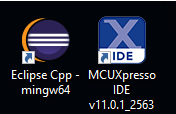
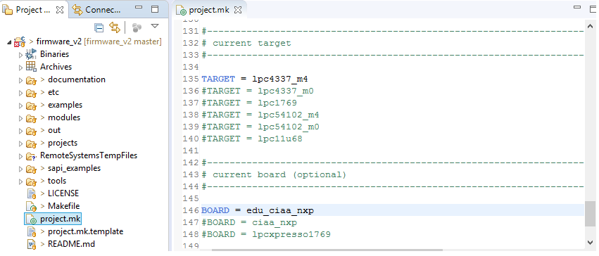

# Sistemas Embebidos
Repositorio para el seminario de sistemas embebidos 66.48

- Diego Luna
- Daniel Romero
- Juan C. Suárez

# Documentación del TP1
**Objetivo**
- **Uso del IDE** edición, compilación y depuración de programas.
- **Uso de GPIO** manejo de Salidas y Entradas Digitales.
- **Documentar lo que se solicita en c/ítems** 

# 1 IDE
Se descargó LPCXpresso 8.2.0 para Windows y se insatalaron los complementos de OpenOCD, eGit y Yakindu StateChart Tools siguiendo los pasos de la [hoja de ayuda](https://campus.fi.uba.ar/pluginfile.php/307047/mod_resource/content/5/Sistemas_Embebidos-2019_2doC-Instalacion_de_Herramientas-Cruz.pdf) de la materia.


<SUB>**Registro del IDE en la página de NXP**


Otras opciones de IDE, son el **MCUXPRESSO**, también de **NXP** o el **ECLIPSE** original, los anteriores son versiones modificadaas de este último. Para estos otros IDE los pasos son similares, ya que los plugins son plugins de Eclipse, pero no es necesario el paso de registro que **NXP** exige para **LPCXpresso**. En general se vió que la versión original de **Eclipse** es mas estable y en este IDE los plugin funcionan mejor. Además de lo dicho anteriormente también se instalaron las herramientas en Linux, en donde las mismas son mas estables y el compilador **GCC** compila mas rápidamente.



Se instaló en Windows **MSYS2** en lugar de **CygWin**, por ser el mismo mas moderno y de mas fácil administración, para proveer las herramientas mínimas de desarrollo Unix (**make** en particular).

## 1.1 Firmware
Utilizando git se descargó el repositorio *firmware_v2* y se copió el archivo *project.mk.template* a *project.mk* utilizando los siguientes comandos:
```sh
$ git clone https://github.com/ciaa/firmware_v2.git
$ cd firmware_v2
$ git status -s
$ git checkout master
$ cp project.mk.template project.mk
```

Posteriormente se ejecutó el Eclipse y se creó un workspace con el nombre Workspace_TPs_SE_2019 y se agregó el firmware_v2. Luego en File--New--Other--C/C++--Makefile Project with Existing Code...

- En **Existing Code Location Browse** se colocó la ubicación de la carpeta *firmware_v2*.
- Se destildó el casillero **C++**.
- Se seleccionó la opción **Cross GCC ó ARM Cross GCC**.

El archivo project.mk se configuró de la siguiente forma:
- PROJECT = sapi_examples/edu-ciaa-nxp/bare_metal/gpio/gpio_02_blinky
- TARGET = lpc4337_m4
- BOARD = edu_ciaa_nxp

