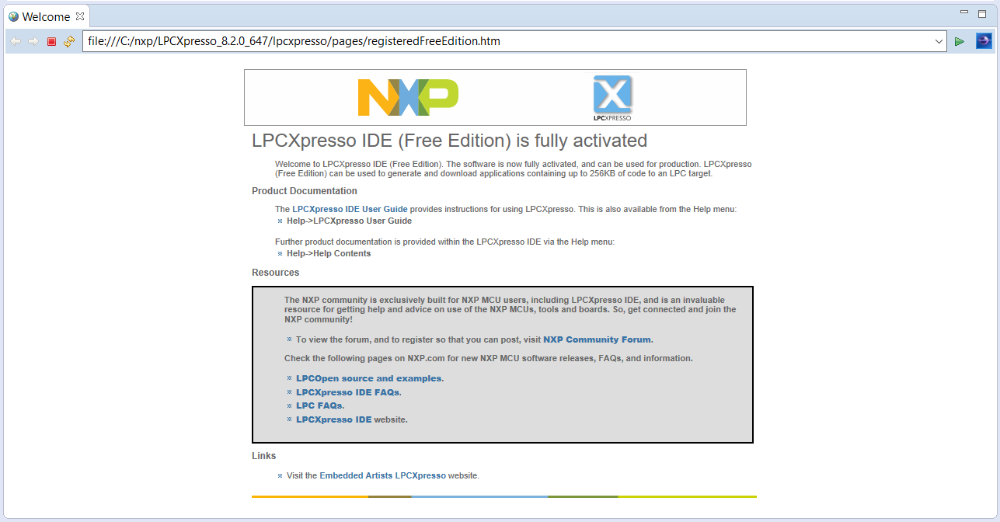

# Sistemas Embebidos
Repositorio para el seminario de sistemas embebidos 66.48

- Diego Luna
- Daniel Romero
- Juan C. Suárez

# Documentación del TP1
**Objetivo**
- **Uso del IDE** edición, compilación y depuración de programas.
- **Uso de GPIO** manejo de Salidas y Entradas Digitales.
- **Documentar lo que se solicita en c/ítems** 

# 1 IDE
Se descargó LPCXpreso 8.2.0 y se insatalaron los complementos de OpenOCD, eGit y Yakindu StateChart Tools siguiendo los pasos de la [hoja de ayuda](https://campus.fi.uba.ar/pluginfile.php/307047/mod_resource/content/5/Sistemas_Embebidos-2019_2doC-Instalacion_de_Herramientas-Cruz.pdf) de la materia.

Registro del IDE en la página de NXP



## 1.1 Firmware
Utilizando git se descargó el repositorio *firmware_v2* y se copió el archivo *project.mk.template* a *project.mk* utilizando los siguientes comandos:
```sh
$ git clone https://github.com/ciaa/firmware_v2.git
$ cd firmware_v2
$ git status -s
$ git checkout master
$ cp project.mk.template project.mk
```