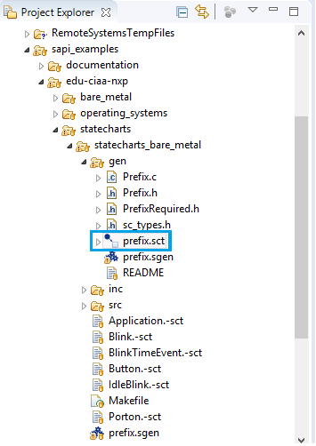

# TP2
**Objetivo**
- **Uso del IDE** edición, compilación y depuración de programas.
- **Uso de GPIO & Diagrama de Estado** manejo de Salidas y Entradas Digitales en Aplicaciones.
- **Documentar lo que se solicita en c/ítems** 

# 1 IDE
Siguiendo los primeros pasos de instalación y configuración del *IDE* enunciados en el *TP1* se estableció como ejemplo guía dentro del *firmware_v2*: *sapi_examples/edu-ciaa-nxp/statecharts/statecharts_bare_metal*

Se copió el ejemplo   *sapi_examples/edu-ciaa-nxp/statcharts/statecharts_bare_metal/gen/*. Dado que no existía el archivo *prefix.sct* se copió y pegó Blinky.-sct y renombró como: *prefix.sct*.

Para Simular el modelo se hizo clic derecho sobre *prefix.sct -> Run Us -> 1 Satechart Simulation*

Para ver los cambios en los estados (de APAGADO a ENCENDIDO) se debe dar clic sobre la opción evTick en la ventana *Simulation*

Para Generar el código del modelo se dió clic derecho sobre *pregix.sgen -> Generate Code Artifacts (Artifacts => Prefix.c, Prefix.h, PrefixRequired.h y sc_types.h)*

Dentro de la carpeta *gen* se se encuentran los archivos: *Prefix.c, Prefix.h, PrefixRequired.h, sc_types.h, prefix.sct, prefix.sgen*

| Nombre del archivo | Descripción |
| ------ | ----------- |
|Prefix.c| Fuente con el nombre del statechart Prefix.sct |
|Prefix.h | Fuente con el nombre del statechart Prefix.sct |
|PrefixRequired.h|Prototipos de funciones)  |
|sc_types.h| Prototipos de variables) |
|prefix.sct |  |
|prefix.sgen|  |

