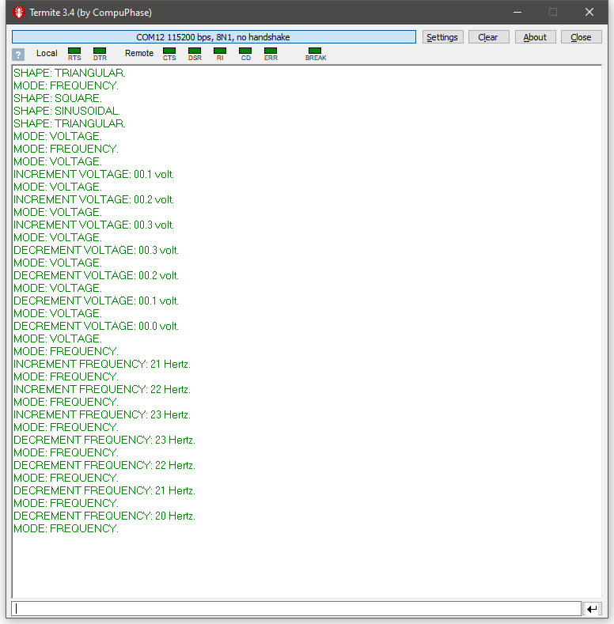
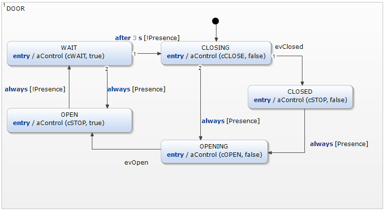
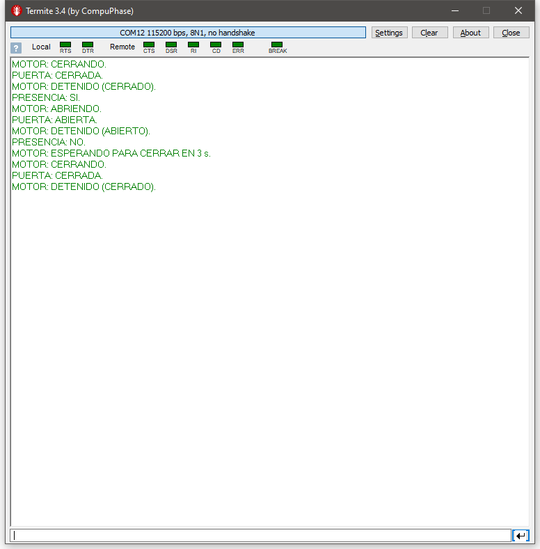
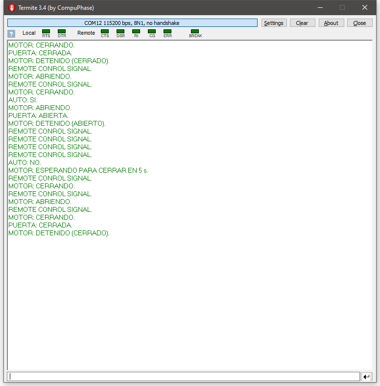
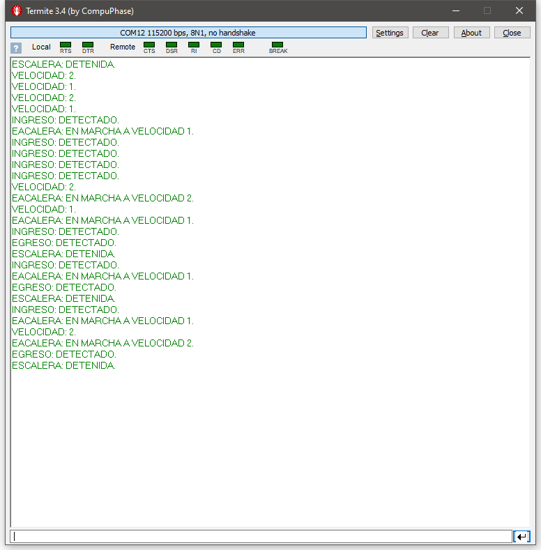
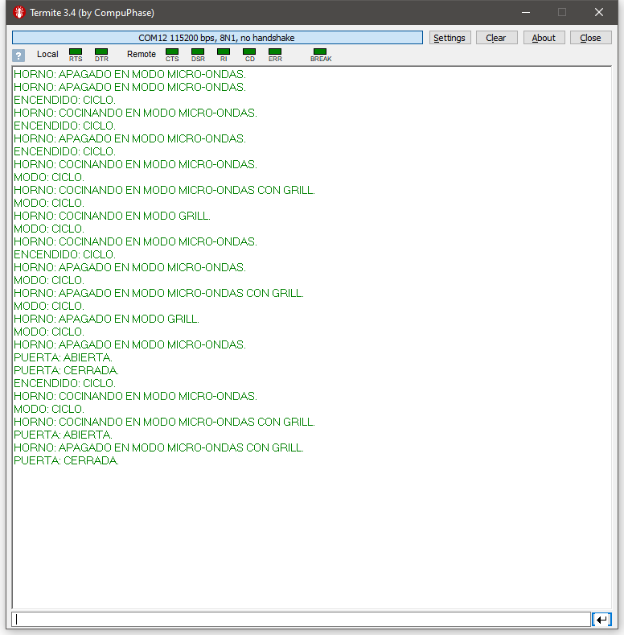

# Sistemas Embebidos
Repositorio para el seminario de sistemas embebidos 66.48

- Diego Luna
- Juan C. Suárez

# Documentación del TP2
**Objetivo**
- LPC43xx Entradas y Salidas (Digitales) de Propósito General (GPIO) – Diagrama de Estado

# Contenidos

- [**IDE**](#IDE)
- [**Instalación del plug-in Yakindu SCT**](#yakindu)
- [**Uso del IDE con el plug-in Yakindu SCT para generar código**](#yakindu-gen)
- [**Makefile modificado para generar automáticamente el código**](#Makefile)
- [**Generación de nuestros modelos para los casos pedidos**](#ourmodels)
- [**Implementar el modelo de control de panel de control de un generador de señales**](#Generador)
- [**Implementar el modelo de control de puerta corrediza automatizada**](#Door)
- [**Implementar el modelo de control de portón de cochera automatizado**](#GarageDoor)
- [**Implementar el modelo de control de escalera mecánica unidireccional automatizada**](#Ladder)
- [**Implementar el modelo de control de horno microondas**](#MicroWaveOven)
- [**Hoja de ruta**](#HojadeRuta)

# 1 IDE 

### 1.a Instalacion de software
Se instalaron los complementos de OpenOCD, eGit y Yakindu StateChart  siguiendo los pasos de la instalación y configuración del *IDE* enunciados en la [guía de instalación de herramientas](https://campus.fi.uba.ar/pluginfile.php/307047/mod_resource/content/5/Sistemas_Embebidos-2019_2doC-Instalacion_de_Herramientas-Cruz.pdf).
Esto ya se resolvió en el TP1. 

Algo importante a aclarar es que se abandonó el uso del **LPCExpresso** o el **MCUExpresso** en favor del **Eclipse** original, y utilizando las últimas versiones de los plugins en lugar de las indicadas en los instructivos, con esta combinación se obtuvo mejores resultados, además de que se trabaja con las últimas versiones con mas funcionalidades y correcciones de bugs.

En particular se reemplazó el plug-in de **ARM on eclipse** por el **MCU on eclipse**, y se instaló el plug-in para FreeRTOS, que las versiones de **NXP** ya trae preinstalado, además se instaló y agregó al PATH el último toolchain de **ARM** de su página Web, esta versión es mas reciente que la incluida por **NXP** en sus propios IDE.

### 1.b Edición de código y debug 

Para el proceso de *edición de código* y *debug* se siguieron los siguientes pasos:

- 1.  Se Selecciono como nombre de Workspace: workspace-SE-2019-TPs (el mismo que utilizó para el TP1).

- 2. En el archivo *project.mk* se configuro el proyecto, el procesador y la placa a utilizar:

> -  PROJECT = sapi_examples/edu-ciaa-nxp/statecharts/statecharts_bare_metal	
> -  TARGET = lpc4337_m4
> -  BOARD = edu_ciaa_nxp

- 3.  Se copiaron en la carpeta sapi_examples/edu-ciaa-nxp/statcharts/statecharts_bare_metal/gen/ los archivos:

> - a. prefix.sct. Se copio y pego Blinky.-sct y  se renombro como: prefix.sct
> - b. pregix.sgen

Los cambios se pueden visualizar en la siguiente figura:

# 2 Instalación y uso del plug-in Yakindu SCT 
Dentro de Eclipse, se agregó el plug-in Yakindu StateChart Tools Menú Help → Install New Software … Work with: **http://updates.yakindu.com/statecharts/releases/**. Se seleccionó el plug-in y luego se siguió las instrucciones del asistente. 

- Para Simular el modelo se hizo clic derecho sobre *prefix.sct -> Run Us -> 1 Satechart Simulation*. Para ver los cambios en los estados (de APAGADO a ENCENDIDO) se hizo clic sobre la opción evTick en la ventana *Simulation* :

- Para Generar el código del modelo se dió clic derecho sobre *pregix.sgen -> Generate Code Artifacts (Artifacts => Prefix.c, Prefix.h, PrefixRequired.h y sc_types.h)*

- Luego se Compilo y debugeo firmware_v2 cambiando la ruta de debug por C:\firmware_v2\out\lpc4337_m4\statecharts_bare_metal.axf

Dentro de la carpeta *gen* se se encuentran los archivos: *Prefix.c, Prefix.h, PrefixRequired.h, sc_types.h, prefix.sct, prefix.sgen*. Su descripción se detalla a continuación:

| Nombre del archivo | Descripción |
| ------ | ----------- |
|Prefix.c| Fuente con el nombre del statechart Prefix.sct |
|Prefix.h | Fuente con el nombre del statechart Prefix.sct |
|PrefixRequired.h|Prototipos de funciones)  |
|sc_types.h| Prototipos de variables) |
|prefix.sct | Yakindu SCT Statechart Model file |
|prefix.sgen|  Yakindu SCT Code Generator Model file |

- Para probar la función de debug se puso un breakpoint en la función que cambia de estado el led para ver el cambio de estado debido a que la frecuencia de interrupción seteada en el programa es demasiado rápida para ver el cambio a simple vista:

## 2.b funciones 

En la siguiente tabla se puede visualizar las siguientes funciones:

| Nombre | Descripción |
| ------ | ----------- |
|  boardConfig(); | configura los pines de entrada y salida    |
|  tickConfig( TICKRATE_MS );  | configura la frecuencia de la interrupciones    |
|  tickCallbackSet( myTickHook, (void*)NULL );  | configura la funcion que se ejecutara con cada interrupcion    |
|  InitTimerTicks(ticks, NOF_TIMERS); | incializa la frecuencia del timer   |
|  prefix_init(&statechart);  | inicializa la maquina de estados    |
|  prefix_enter(&statechart);   |  cambia el estado de la maquina de estados   |
|  UpdateTimers(ticks, NOF_TIMERS);  | actualiza la frecuencia del timer    |
|  prefixIface_raise_evTick(&statechart);| activa el evento etick |
|  IsPendEvent(ticks, NOF_TIMERS, ticks[i].evid)       | devuelve true si se cumplio el tiempo de eventos dado por NOF_TIMERS|
|  prefix_raiseTimeEvent(&statechart, ticks[i].evid);   |  activa el evento etick   |
|  MarkAsAttEvent(ticks, NOF_TIMERS, ticks[i].evid);   |  setea el evento pendiente en false  |
|  prefix_runCycle(&statechart);   | cambia el estado de la maquina de estados  |

## 2.c Constantes y variables.

En la siguiente tabla se puede visualizar las siguientes constantes:

| Nombre | Descripción |
| ------ | ----------- |
|  TICKRATE_MS   |  setea la frecuencia de interrupciones   |
|  USE_TIME_EVENTS  | flag utilizado para decidir si se ejecutan eventos por tiempo o no    |
|  NOF_TIMERS  |  constante utilizada para definir el tiempo de cada evento  |
|  SysTick_Time_Flag  |  flag utilizado para saber si se produjo una interrupción  |

# 3. Uso del IDE con el plug-in Yakindu SCT para generar código 

## 3.a Migrar proyecto
Se migró el proyecto sapi_examples/edu-ciaa-nxp/statchart/statechart_bare_metal (parpadeo del LEDs c/sAPI & Yakindu SCT) 
a: projects/TP2 dentro firmware_v2.

## 3.b Generación del código para el ejemplo

Para cada caso se copio los archivos *Blinky.-sct*,*BlinkyTimeEvent.-sct*,*Button.-sct*,*ldelBlinky.-sct*, *Application.-sct*,Porton.-sct y se los renombro como *prefix.sct* cada uno por separado. .Luego se genero el codigo de cada uno por separado. Para generar los codigos fuentes correspondientes de cada maquina de estado se usaron los archivos de *prefix.sgen* -> generate code artifacts.Como se puede visualizar en la siguiente figura:

# 4. Makefile modificado para generar automáticamente el código 

Para simplificar la compilación de los casos pedidos se modificó el Makefile del proyecto, pero también el global, que se encuentra en la raíz de los fuentes del firmware, se aprovechó el hecho de que el plug-in de Yakindu tiene un generador de código para la línea de comando, para integrar esto al Makefile, además de un script que realiza la copia del modelo correcto para cada caso.
Estas modificaciones nos permiten invocar a make con la siguiente sintaxis:

<pre><code>
make clean && make -j8 YAKINDU_MODEL=5
</code></pre>

Donde 5, en este caso es el número de ejemplo a compilar que se selecciona para copia y generación.

Además para acelerar la compilación se hizo una pequeña modificación extra que permite el funcionamiento correcto de la compilación paralela con **gcc** (opción -j), es simplemente reeeplazar toda invocación anidada de **make** por el macro **$(MAKE)**, con este cambio las subsiguientes instancias utilizan el mismo administrador de compilación, permitiendo la compilación en paralelo.

A continuación se muestra el bloque de código agregado en el Makefile global:

<pre><code>
yakindu:
	@echo ""
	@echo "Copying model..."
	@echo ""	
	@"$(PROJECT)/gen/copy_model.sh" $(YAKINDU_MODEL)
	@echo ""			
	@echo "Copying done."
	@echo ""		
	@echo "Invoking YAKINDU code generator..."
	@echo ""
	@$(SCC) -d $(PROJECT)/gen
	@echo ""		
	@echo "YAKINDU done."
	@echo ""

.DEFAULT: all

.PHONY: all doc clean clean_all openocd download erase info ctags generate yakindu
</code></pre>

El script *copy_model.sh* copia el modelo seleccionado.

Además otra cosa importante es que en el *Makefile* local del proyecto se agrego algo de compilación condicional y el paso de un parámetro a **gcc** que permite sobrescribir un define.

A continuación se muestran las partes relevantes del *Makefile* local:

<pre><code>
YAKINDU_MODEL ?= 5

SYMBOLS += -DACTIVE_ST=$(YAKINDU_MODEL)

ifeq ($(OS),Windows_NT)
	SCC = scc.bat
else
	SCC = scc
endif
</code></pre>

Se puede observar como se pasa el símbolo del define a **gcc** (opción -D), y como se usa compilación condicional para definir el script de Yakindu que genera el código para que funcione correctamente en **Windows** y **Unix**.

# 5. Generación de nuestros modelos para los casos pedidos 

Con los códigos generados en el punto anterior se modifico el #define TEST (SCT_?) con ? ={1,2,3,4,5} en el *main.c* para seleccionar entre los diferentes casos de las máquinas de estado como se puede visualizar en la siguiente figura:

Para la implementación de la máquina de estados para cada uno de los casos propuestos,se realizaron los diagramas de estado,se generaron los códigos fuente(prefix.sgen -> generate code artifacts) y se modifico el archivo makefile, añadiendo la opción de compilación paralela:

Para la indicación del funcionamiento de cada ejemplo se utilizó tanto los LEDs de la placa como la consola serial, en la cual se muestran mensajes de debug sobre el estado y los eventos de las máquinas de estado.

Algo muy importante, es que se puso énfasis en reducir el código escrito a mano necesario para el funcionamiento de las máquinas. En particular la máquina de estados usada para procesar las teclas, que se reusó en todos los ejemplos, no necesita nada de código escrito a mano para funcionar, solo dos funciones que determinan los eventos que las teclas funcionan y algo que nos pareció muy interesante, una función que permite la repetición periódica de los eventos si las teclas se mantienen presionadas, esto es totalmente personalizable para cada caso y tecla, devolviendo *true* en la función *RepeatButtons* si se recibe la tecla o combinación de teclas que se desea se repitan. En forma similar la función *ImplementButtons* recibe la o las teclas presionadas ya habiendo sido realizado el debounce, permitiendo implementar su funcionameinto, en general emitiendo eventos.

## 6. Implementar el modelo de control de panel de control de un generador de señales 
Para el caso del panel de control de un generador de señales se tuvo en cuenta: tensión de 0 a 10V, frecuencia de 20 a 20.000Hz y 3
formas de señal.

Para este modelo se consideró el siguiente esquema:

 **Tecla 1**: Cambio de forma de onda (triangular cuadrada, sinusoidal). Responde al presionarse y no vuelve actuar hasta soltarse.
 
 **Tecla 2**: Cambio de modo de variable ajustada (tensión, frecuencia. Responde al presionarse y no vuelve actuar hasta soltarse.
 
 **Tecla 3**: Incrementar variable ajustada. Responde al presionarse y vuelve actuar a los 120 ms de mantenerse sostenida.
 
 **Tecla 4** : Decrementar variable ajustada. Responde al presionarse y vuelve actuar a los 120 ms de mantenerse sostenida.
 
 **LED RGB**: Indica la forma de onda, rojo para triangular , verde para cuadrada  y azul para sinusoidal .
 
 **LED 1**: Indica modo frecuencia.
 
 **LED 2**: Indica modo tensión.
 
 **LED 3**: Indica acción de las teclas incrementar o decrementar con un parpadeo.
 
 **Consola serial**: Indica cambios de forma y modo y muestra el valor de las variables controladas.

A continuación se muestran las diferentes MEFs utilizadas, dado que se trata de una MEF compuesta: *SHAPE*, *MODE*, *BUTTONS*:

*SHAPE*

*MODE*

*BUTTONS*

A continuación se muestra una captura de la consola serial para este ejemplo funcionando:

## 7. Implementar el modelo de control de puerta corrediza automatizada 
Para el caso de la puerta corrediza automatizada se tuvo en cuenta: motor con movimiento en dos sentidos, sensor de presencia y fines de carrera. 

Para este modelo se consideró el siguiente esquema:

 **Tecla 1**: No se usa.
 
 **Tecla 2**: Simula el sensor de fin de carrera para la puerta cerrada, con una pulsación se indica que el sensor se activó, solo funciona mientras la puerta está cerrando.
 
 **Tecla 3**: Simula el sensor de fin de carrera para la puerta abierta, con una pulsación se indica que el sensor se activó, solo funciona mientras la puerta está abriendo.
 
 **Tecla 4** : Simula el sensor de presencia, con una pulsación hace toogle para el estado de presencia.
 
 **LED RGB**: Indica el estado del motor, rojo para motor abriendo , verde para motor cerrando  y azul para motor detenido .
 
 **LED 1**: Indica que el sensor de fin de carrera de puerta cerrada esta activo.
 
 **LED 2**: Indica que el sensor de fin de carrera de puerta abierta esta activo.
 
 **LED 3**: Indica que el sensor de presencia esta activo.
 
**Consola serial**: Indica estados del motor y sensores.

A continuación se muestran las diferentes MEFs utilizadas, dado que se trata de una MEF compuesta: *MODE*, *BUTTONS*, *SENSORS*:

*MODE*

*BUTTONS*

*SENSORS* 

A continuación se muestra una captura de la consola serial para este ejemplo funcionando:

## 8. Implementar el modelo de control de portón de cochera automatizado 
Para el caso del portón de la cochera automatizado se tuvo en cuenta: motor con movimiento en dos sentidos, control remoto de apertura/cierre, fines de carrera y señalización luminosa.

Para este modelo se consideró el siguiente esquema:

 **Tecla 1**: Simula la señal del control remoto, que funciona en modo toogle.
 
 **Tecla 2**: Simula el sensor de fin de carrera para la puerta cerrada, con una pulsación se indica que el sensor se activó, solo funciona mientras la puerta está cerrando.
 
 **Tecla 3**: Simula el sensor de fin de carrera para la puerta abierta, con una pulsación se indica que el sensor se activó, solo funciona mientras la puerta está abriendo.
 
 **Tecla 4** : Simula el sensor de presencia del vehículo, con una pulsación hace toogle para el estado de presencia.
 
 **LED RGB**: Indica el estado del motor, rojo para motor abriendo , verde para motor cerrando  y azul para motor detenido , indica con un blink de color blanco la recepción de la señal del control remoto.
 
 **LED 1**: Indica que el sensor de fin de carrera de puerta cerrada esta activo.
 
 **LED 2**: Indica que el sensor de fin de carrera de puerta abierta esta activo.
 
 **LED 3**: Indica que el sensor de presencia esta activo.
 
**Consola serial**: Indica estados del motor y sensores.

A continuación se muestran las diferentes MEFs utilizadas, dado que se trata de una MEF compuesta: *DOOR*, *SENSORS* y *BUTTONS*:

*DOOR*

*SENSORS*

*BUTTONS*

A continuación se muestra una captura de la consola serial para este ejemplo funcionando:

## 9. Implementar el modelo de control de escalera mecánica unidireccional automatizada 
Para el caso del portón de la escalera mecánica unidireccional automatizada se tuvo en cuenta: motor c/movimiento en un sentido y dos
velocidades, sensores de ingreso, egreso y señalización luminosa.

Para este modelo se consideró el siguiente esquema:

 **Tecla 1**: No se usa.
 
 **Tecla 2**: Cambia entre las velocidades 1 y 2, cicla entre ambas velocidades.
 
 **Tecla 3**: Simula el sensor presión de ingreso.
 
 **Tecla 4** : Simula el sensor de presión de egreso.
 
 **LED RGB**: Indica el estado de la escalera, rojo para la escalera funcionando a velocidad 2 , verde para la escalera funcionando a velocidad 1  y azul para la escalera detenida .
 
 **LED 1**: Indica con un blink la acción del botón de cambio de velocidad.
 
 **LED 2**: Indica que el sensor de fin de carrera de puerta abierta esta activo.
 
 **LED 3**: Indica que el sensor de presencia esta activo.
 
**Consola serial**: Indica estados de la escalera y de los sensores.

A continuación se muestran las diferentes MEFs utilizadas, dado que se trata de una MEF compuesta: *LADDER*, *SENSORS* y *BUTTONS*:

*LADDER*

*SENSORS*

*BUTTONS*

A continuación se muestra una captura de la consola serial para este ejemplo funcionando:

## 10. Implementar el modelo de control de horno microondas 
Para el caso de horno microondas se tuvo en cuenta: 3 modos de cocción seleccionable por botón de modo, botón de comenzar/terminar y sensor de apertura de puerta.

A continuación se muestran las diferentes MEFs utilizadas, dado que se trata de una MEF compuesta: *MODE*, *BUTTONS*, *SENSORS* y *OVEN* 

Para este modelo se consideró el siguiente esquema:

 **Tecla 1**: No se usa.
 
 **Tecla 2**: Encendido del horno, funciona en modo toogle.
 
 **Tecla 3**: Cicla entre los tres modos de cocción del horno.
 
 **Tecla 4** : Simula el sensor de puerta abierta, funciona en modo toogle.
 
 **LED RGB**: Indica el estado del horno, rojo para el modo microondas , verde para el modo grill  y azul para indicar la luz del horno . El color final será la combinación obtenida de los modos, por ejemplo, con el horno apagado y la puerta cerrada, estará el LED apagado, pero con la puerta abierta será azul.
 
 **LED 1**: Indica con un blink la acción del botón de encendido.
 
 **LED 2**: Indica con un blink la acción del botón de modo.
 
 **LED 3**: Indica que la puerta está abierta.
 
**Consola serial**: Indica estados del horno y los modos.

A continuación se muestran los diagramas de estados de cada una de las máquinas de estado:

*MODE*

*BUTTONS*

*SENSORS* 

*OVEN*

A continuación se muestra una captura de la consola serial para este ejemplo funcionando:

# 11. Hoja de ruta 

