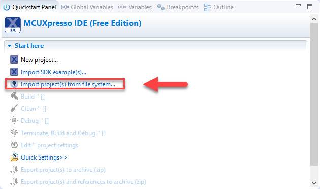

# Sistemas Embebidos
Repositorio para el seminario de sistemas embebidos 66.48

- Diego Luna
- Juan C. Suárez

# Documentación del TP3
**Objetivo**

- Uso del IDE (edición, compilación y depuración de programas).
- Uso de GPIO & FreeRTOS (manejo de Salidas y de Entradas Digitales en Aplicaciones).
- Documentar lo que se solicita en c/ítems.

# Contenidos

- [**IDE**](#IDE)
- [**Análisis del proyecto del proyecto freertos_examples_1_to_9**](#freertosexamples1to9 )
- [**Análisis del proyecto del proyecto freertos_examples_10_to_16**](#freertosexamples10to16)
- [**Punto 4: Tarea 1 periódica**](#punto4)
- [**Punto 5: Intercambio de las palabras semáforo <--> cola**](#punto5)
- [**Punto 6: Tareas de secuencia fija**](#punto6)
- [**Hoja de ruta**](#HojadeRuta)

# 1 IDE 

### 1.a Instalacion de software
Se utilizó **MCUXpresso** somo **IDE**. Se creó un Workspace de nombre *workspace-EDU_CIAA_NXP-TP3*. Se importó la carpeta descomprimida de *LPCXpresso-FreeRTOS-Examples.zip* mediante la opción *import project(s) from file system*. Dicha carpeta contiene los proyectos:

- lpc_chip_43xx (librería p/chips LPC43xx de NXP).
- lpc_board_nxp_lpcxpresso_4337 (librería p/placas NXP).
- freertos_examples_1_to_9 (ejemplos de aplicación). 
- freertos_examples_10_to_16 (ejemplos de aplicación).

